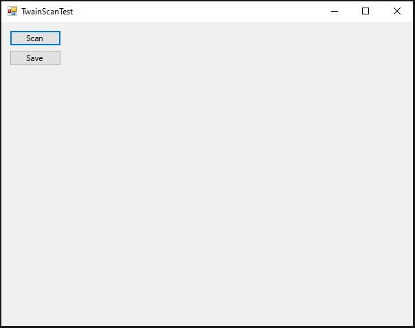
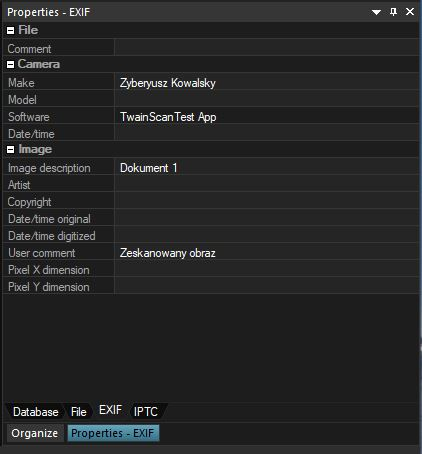

# TwainScanApp
Prosta aplikacja skanująca dokument za pomocą sterownika TWAIN.

## Używane technologie
* C#
* .NET 4.8
* WinForms

## Jak używać aplikacji
1. Pobierz aplikację z sekcji release.
2. Kiedy uruchomisz aplikację, będzie wyglądała tak:
   

3. Wygląd aplikacji po zeskanowaniu przykładowego dokumentu:
   

 
4. Możesz zapisać obraz w formacie .png lub .jpg. W przypadku zapisu w formacie .jpg do obrazka dodawane są przykładowe metadane EXIF.

Uwagi:
1. W systemie musi być zainstalowany sterownik TWAIN do skanera, lub urządzenia wielofunkcyjnego.
2. Program nie był testowany w systemie bez zainstalowanego sterownika - brak obsługi takiej sytuacji.
